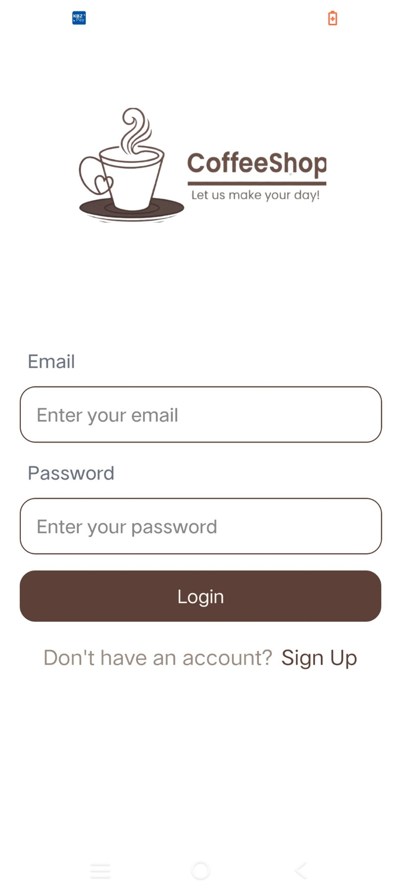
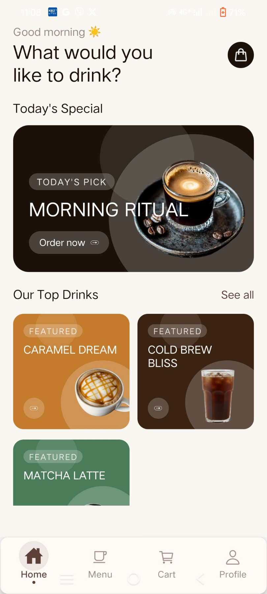
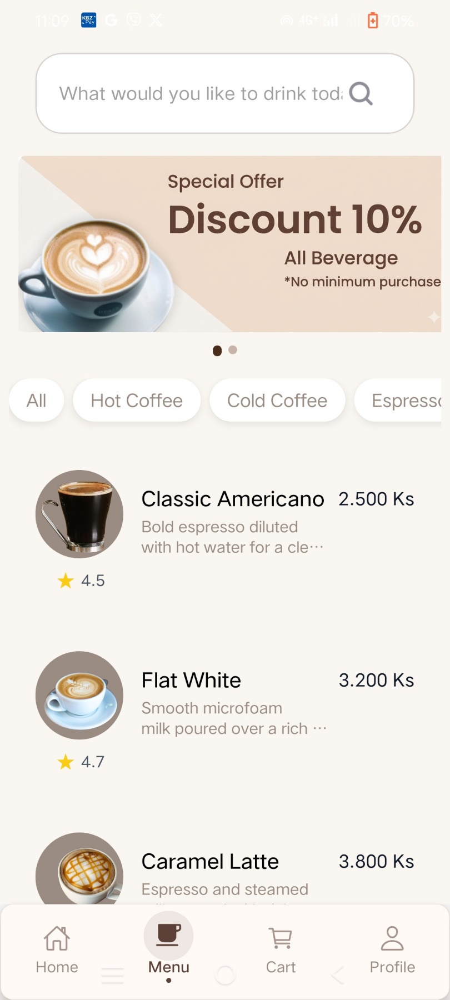
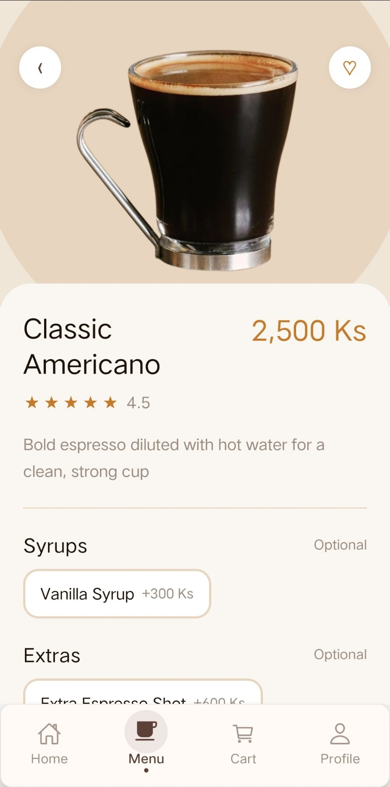
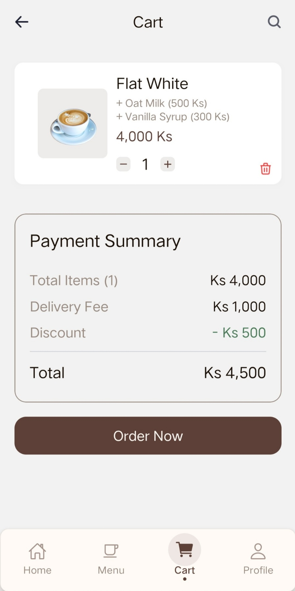
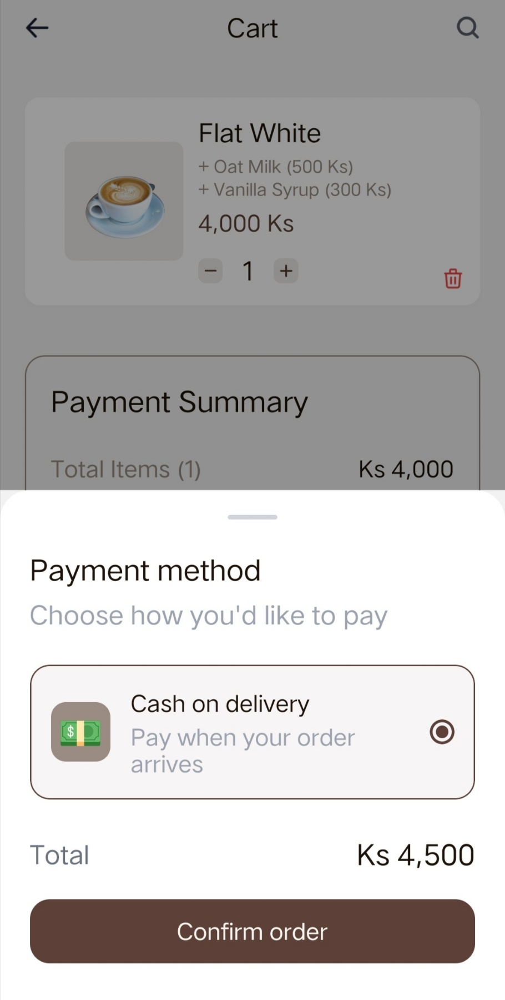
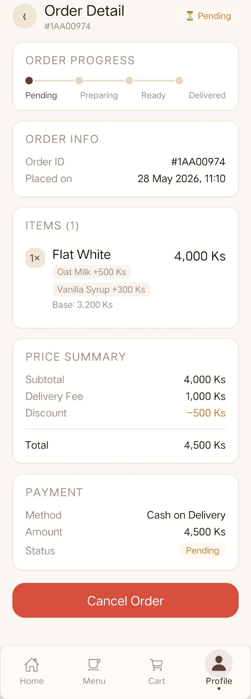
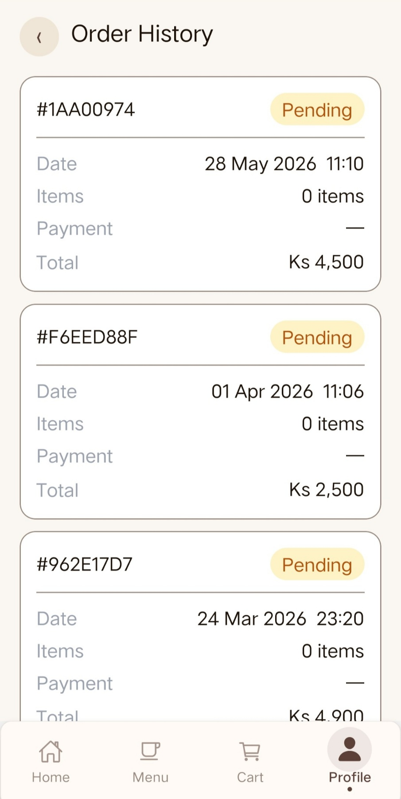

# 🚀 Coffee Shop Mobile App

<div align="center">

[](https://github.com/ZweLinn/coffee-shop/stargazers)

[](https://github.com/ZweLinn/coffee-shop/network)

[](https://github.com/ZweLinn/coffee-shop/issues)

[](LICENSE) <!-- TODO: Add LICENSE file and name -->

[](https://expo.dev/)

**A sleek and responsive mobile application for browsing and ordering coffee, built with React Native and Expo.**

[Live Demo on Expo Go](https://expo.dev/@zwe-linn/coffee-shop) <!-- TODO: Add actual Expo Go demo link -->

</div>

## 📖 Overview

This project is a modern mobile application designed to provide a seamless experience for coffee enthusiasts to browse a menu, customize their orders, and manage their shopping cart. Built using React Native and Expo, it leverages a powerful combination of technologies to deliver a fluid and intuitive user interface. The app focuses on a clean design and responsive performance, making it easy for users to find and order their favorite coffee on the go.

## ✨ Features

- **Browse Extensive Coffee Menu:** Explore a diverse selection of coffee products, categorized for easy discovery.
- **Detailed Product Views:** View comprehensive information about each coffee item, including descriptions, pricing, and customization options.
- **Intuitive Shopping Cart:** Effortlessly add, remove, and adjust quantities of items in your cart.
- **Modern & Responsive UI:** Enjoy a beautifully crafted user interface that adapts seamlessly across various mobile devices, powered by Tailwind CSS (NativeWind).
- **Efficient State Management:** Utilizes a robust state management solution (e.g., Zustand) to maintain application data, such as the shopping cart contents, across sessions.
- **Smooth Navigation:** Provides a fluid and predictable navigation experience between different sections of the app.

## 🖥️ Screenshots

















## 🛠️ Tech Stack

**Frontend (Mobile):**

- **React Native:** ``
- **Expo:** ``
- **TypeScript:** ``
- **Tailwind CSS (NativeWind):** ``
- **Zustand (State Management):** `` <!-- Assumed state management library -->
- **React Navigation:** `` <!-- Assumed navigation library -->

**Tools & Development:**

- **npm (Package Manager):** ``
- **ESLint (Linting):** ``
- **Babel (Transpiler):** ``

## 🚀 Quick Start

Follow these steps to get the Coffee Shop Mobile App up and running on your local machine.

### Prerequisites

Before you begin, ensure you have the following installed:

- **Node.js**: A recent LTS version (e.g., 18.x or 20.x).
- **npm**: Comes with Node.js.
- **Expo CLI**: Install globally using npm:
  ```bash
  npm install -g expo-cli
  ```

### Installation

1.  **Clone the repository**

    ```bash
    git clone https://github.com/ZweLinn/coffee-shop.git
    cd coffee-shop
    ```

2.  **Install dependencies**
    Use npm to install all required packages:

    ```bash
    npm install
    ```

3.  **Environment setup**
    This project does not require a `.env` file. Configuration is primarily handled through `app.json` and `tailwind.config.js`.

4.  **Database setup**
    This is a client-side mobile application and does not require a direct database setup. It's designed to consume data from an external API.

5.  **Start development server**
    Launch the Expo development server:

    ```bash
    npm start
    ```

    This will open a new tab in your browser with the Expo Developer Tools.

6.  **Open your application**
    You can run the application on:
    - **iOS Simulator or Android Emulator:** Use the Expo Developer Tools to open the app on your configured simulator/emulator.
    - **Physical Device:** Scan the QR code displayed in the Expo Developer Tools using the [Expo Go app](https://expo.dev/client) on your iOS or Android device.

## 📁 Project Structure

```
coffee-shop/
├── .vscode/               # VS Code editor settings
├── app/                   # Main application screens and navigation
│   └── (screens and layout files, e.g., _layout.tsx)
├── assets/                # Static assets (images, fonts, etc.)
│   ├── images/
│   └── icon.png
├── components/            # Reusable UI components
├── constants/             # Global constants and data
├── lib/                   # Utility functions and helper modules
├── store/                 # Application state management (e.g., Zustand store)
├── .gitignore             # Files and directories ignored by Git
├── app.json               # Expo application configuration
├── babel.config.js        # Babel configuration for transpilation
├── eslint.config.js       # ESLint configuration for code quality
├── image.d.ts             # TypeScript declaration for image imports
├── metro.config.js        # Metro bundler configuration
├── nativewind-env.d.ts    # NativeWind (Tailwind CSS for React Native) types
├── package-lock.json      # npm dependency lock file
├── package.json           # Project metadata and scripts
├── tailwind.config.js     # Tailwind CSS configuration for NativeWind
├── tsconfig.json          # TypeScript compiler configuration
└── type.d.ts              # Custom TypeScript type definitions
```

## ⚙️ Configuration

### Configuration Files

- **`app.json`**: Configures the Expo application, including name, icon, splash screen, and platform-specific settings.
- **`tailwind.config.js`**: Customizes the Tailwind CSS settings for NativeWind, allowing for theme adjustments and utility class extensions.
- **`tsconfig.json`**: Defines TypeScript compiler options for the project.
- **`babel.config.js`**: Configures Babel presets and plugins for JavaScript/TypeScript compilation.
- **`metro.config.js`**: Customizes the Metro bundler behavior for React Native.
- **`eslint.config.js`**: Sets up linting rules to maintain code quality and consistency.

## 🔧 Development

### Available Scripts

The `package.json` includes the following scripts for development:

| Command | Description |

|-------------------|---------------------------------------------------|

| `npm start` | Starts the Expo development server. |

| `npm run android` | Starts the app on an Android emulator or device. |

| `npm run ios` | Starts the app on an iOS simulator or device. |

| `npm run web` | Starts the app in a web browser (Expo Web). |

### Development Workflow

1.  After cloning and installing dependencies, run `npm start`.
2.  Use the Expo Developer Tools to open the app on your preferred simulator/emulator or scan the QR code with Expo Go on your physical device.
3.  Any changes saved in the source code will hot-reload the application, providing instant feedback.

## 🧪 Testing

This project is configured with ESLint for code quality checks. While explicit unit/integration test commands were not detected in `package.json`, typical React Native projects often use Jest for testing.

```bash

# Run ESLint to check for code quality issues
npm run lint # Assuming a lint script is present in package.json
```

<!-- TODO: If unit tests are implemented, add relevant test commands here -->

## 🚀 Deployment

The app can be deployed to app stores using Expo's build services.

### Production Build

To create a production-ready build for Android or iOS:

```bash

# For Android (.apk or .aab)
eas build --platform android

# For iOS (.ipa)
eas build --platform ios
```

_Note: You need to have [EAS CLI](https://docs.expo.dev/build/introduction/) installed and configured for your project._

### Deployment Options

- **Expo Application Services (EAS):** Recommended for building and submitting your app to Google Play Store and Apple App Store. Refer to the [Expo documentation](https://docs.expo.dev/build/setup/) for detailed steps.

## 🤝 Contributing

We welcome contributions to the Coffee Shop Mobile App! If you're interested in improving the project, please consider:

1.  Forking the repository.
2.  Creating a new branch (`git checkout -b feature/your-feature-name`).
3.  Making your changes and ensuring they pass linting and testing.
4.  Committing your changes (`git commit -m 'Add new feature'`).
5.  Pushing to the branch (`git push origin feature/your-feature-name`).
6.  Opening a Pull Request.

Please ensure your code adheres to the existing style and quality standards.

### Development Setup for Contributors

Follow the [Quick Start](#🚀-quick-start) section to set up your development environment.

## 📄 License

This project is currently licensed under `null` as per repository metadata. Please refer to the `LICENSE` file in the root of the repository (if created) for detailed information. <!-- TODO: Add a LICENSE file (e.g., MIT, Apache 2.0) and update this section -->

## 🙏 Acknowledgments

- Built with [React Native](https://reactnative.dev/) and [Expo](https://expo.dev/).
- Styled with [Tailwind CSS](https://tailwindcss.com/) via [NativeWind](https://www.nativewind.dev/).
- State management powered by [Zustand](https://zustand-demo.pmnd.rs/). <!-- If this is the chosen library -->
- Thanks to all the open-source contributors whose tools and libraries made this project possible.

<div align="center">

**⭐ Star this repo if you find it helpful!**

Made with ❤️ by [ZweLinn](https://github.com/ZweLinn)

</div>
